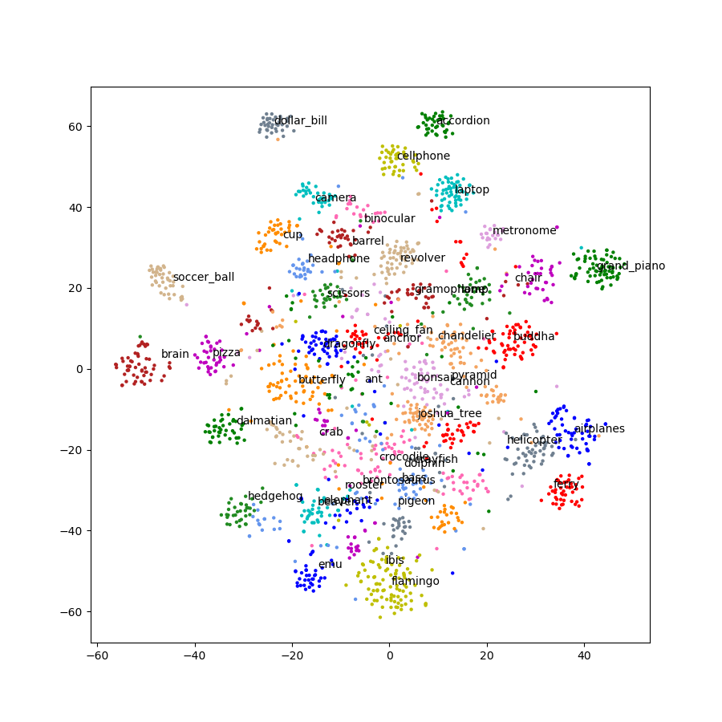
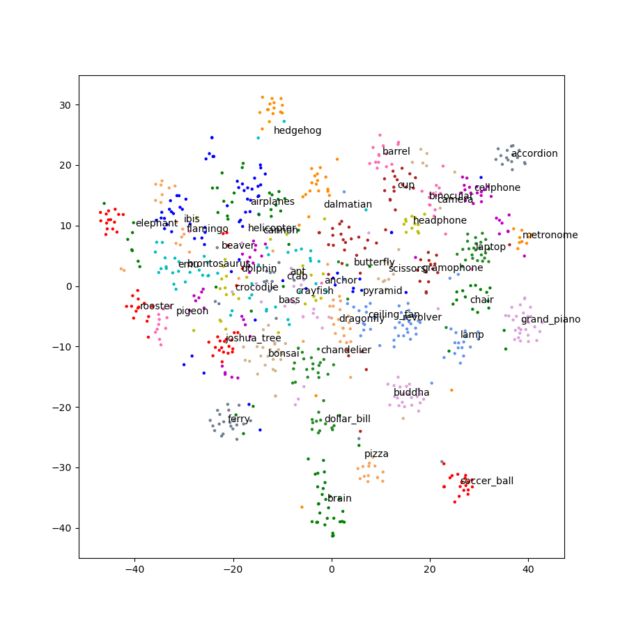
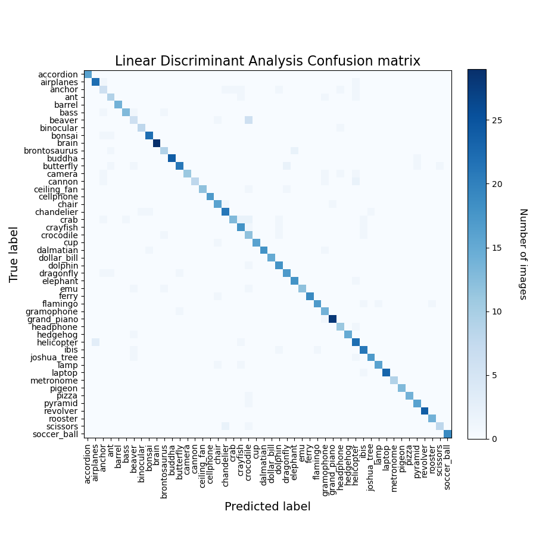

# CNN-ML-Classify-PyTorch
使用PyTorch预训练好的RNN模型来提取预分类特征，进而使用预分类特征在机器学习上进行训练和分类。
## 项目来源

#### 项目借鉴于github上的([地址](https://github.com/snatch59/cnn-svm-classifier))

1. 此示例使用来自 Caltech 图像的 48 个标记图像的子集设置(http://www.vision.caltech.edu/Image_Datasets/Caltech101/)，每个标签限制在 40 到 80
   张图像之间。图像被CNN模型进行特征提取。
2. 使用 2048-d 特征进行降维 `t-distributed stochastic neighbor embedding` (t-SNE) t-分布随机邻域嵌入来转换它们成易于可视化的二维特征。请注意，使用 **t-SNE**
   作为一个提供信息的步骤。如果相同的颜色/标签点大多是聚集在一起，我们很有可能可以使用这些功能训练一个高精度的分类器。
3. 将 2048-d 标记的特征呈现给许多分类器。 最初，该项目是训练支持向量机 分类图像，但是为了比较，这已扩展到下列的：

* Support Vector Machine (SVM, LinearSVC)
* Extra Trees (ET)
* Random Forest (RF)
* K-Nearest Neighbor (KNN)
* Multi-Layer Perceptron (ML)
* Gaussian Naive Bayes (GNB)
* Linear Discriminant Analysis (LDA)
* Quadratic Discriminant Analysis (QDA)

## 安装教程

需要安装 PyTorch GPU 和 sklearn，最好使用GPU。 电脑显卡型号：NVIDIA GeForce
GTX1650，整个`train.py`文件运行时间233.41s，整个`test.py`文件运行时间61.64s。

## 使用说明

1. 下载完代码后，首先直接在此目录下解压`caltech_101_images.zip`，然后将图像放入`./caltech_101_images/train`文件夹中，同时和train同一级目录创建test目录。
* 最终文件结构：
* |
* |-- caltech_101_images
* |   |-- train **解压放置的目录**
* |   |-- test
2. 可以直接使用`datasetSegmentation.py`脚本进行数据分割，脚本默认是30%测试数据，脚本会将分割好的测试数据集从`train`目录搬运到`test`目录中。
3. 之后可以使用`train.py`脚本进行训练，脚本会将训练好的模型放到`model`目录中，同时在训练中也会进行test的测试，这个测试是和`test.py`
   这个脚本测试结果相同，`test.py`这个脚本测试是需要`train.py`训练完的模型。
4. 可以使用`c-svc_classify_features.py`脚本进行SVC的网格搜索，寻找较好的参数。

## 训练和测试的结果如下：

#### 训练集图片数量： 2071；测试集图片数量：860.

### 每个CNN模型运行`train.py`的时间和最好的正确率

| 模型              | time    | best acc | 特征维度 |
|-----------------|---------|----------|------|
| Inception V3    | 194.68s | 94.4%    | 2048 |
| Resnet18        | 73.47s  | 91.9%    | 512  |
| Resnet34        | 84.78s  | 94.0%    | 512  |
| Resnet50        | 143.16s | 93.3%    | 2048 |
| ResNext50_32x4d | 155.48s | 94.9%    | 2048 |
| DenseNet121     | 121.56s | 96.9%    | 1024 |
| MNASNet0_5      | 104.16s | 91.7%    | 1280 |
| MNASNet1_0      | 94.50s  | 93.0%    | 1280 |

### Inception V3 模型

| 模型                              | 时间     | 正确率   |
|---------------------------------|--------|-------|
| LinearSVC                       | 5.00s  | 94.4% |
| SVC                             | 12.72s | 93.5% |
| Extra Tree                      | 0.70s  | 88.5% |
| Random Forest                   | 7.73s  | 85.1% |
| K-Nearest Neighbours            | 2.68s  | 87.1% |
| Multi-layer Perceptron          | 10.43s | 94.1% |
| Gaussian Naive Bayes            | 1.10s  | 87.7% |
| Linear Discriminant Analysis    | 4.38s  | 31.9% |
| Quadratic Discriminant Analysis | 1.06s  | 3.7%  |

### Resnet18 模型

| 模型                              | 时间    | 正确率   |
|---------------------------------|-------|-------|
| LinearSVC                       | 2.33s | 91.4% |
| SVC                             | 2.90s | 91.5% |
| Extra Tree                      | 0.48s | 85.8% |
| Random Forest                   | 4.26s | 82.2% |
| K-Nearest Neighbours            | 0.71s | 80.9% |
| Multi-layer Perceptron          | 3.75s | 91.9% |
| Gaussian Naive Bayes            | 0.35s | 87.8% |
| Linear Discriminant Analysis    | 0.40s | 90.7% |
| Quadratic Discriminant Analysis | 0.51s | 3.7%  |

### Resnet34 模型

| 模型                              | 时间    | 正确率   |
|---------------------------------|-------|-------|
| LinearSVC                       | 1.94s | 93.0% |
| SVC                             | 2.78s | 93.5% |
| Extra Tree                      | 0.43s | 90.1% |
| Random Forest                   | 4.27s | 86.6% |
| K-Nearest Neighbours            | 0.68s | 87.9% |
| Multi-layer Perceptron          | 3.01s | 93.7% |
| Gaussian Naive Bayes            | 0.27s | 90.3% |
| Linear Discriminant  Analysis   | 0.39s | 94.0% |
| Quadratic Discriminant Analysis | 0.46s | 3.8%  |

## Resnet50 模型

| 模型                              | 时间     | 正确率   |
|---------------------------------|--------|-------|
| LinearSVC                       | 8.35s  | 92.2% |
| SVC                             | 10.15s | 93.0% |
| Extra Tree                      | 0.78s  | 88.8% |
| Random Forest                   | 8.28s  | 87.2% |
| K-Nearest Neighbours            | 2.70s  | 84.2% |
| Multi-layer Perceptron          | 16.04s | 93.3% |
| Gaussian Naive Bayes            | 1.07s  | 89.4% |
| Linear Discriminant Analysis    | 4.46s  | 31.9% |
| Quadratic Discriminant Analysis | 1.04s  | 2.2%  |

## ResNext50_32x4d 模型

| 模型                              | 时间     | 正确率   |
|---------------------------------|--------|-------|
| LinearSVC                       | 6.37s  | 94.5% |
| SVC                             | 10.95s | 93.7% |
| Extra Tree                      | 0.79s  | 88.8% |
| Random Forest                   | 8.38s  | 87.0% |
| K-Nearest Neighbours            | 2.64s  | 87.4% |
| Multi-layer Perceptron          | 14.96s | 94.9% |
| Gaussian Naive Bayes            | 1.07s  | 91.0% |
| Linear Discriminant Analysis    | 4.45s  | 29.7% |
| Quadratic Discriminant Analysis | 1.04s  | 3.0%  |

## DenseNet121 模型

| 模型                              | 时间    | 正确率   |
|---------------------------------|-------|-------|
| LinearSVC                       | 2.71s | 96.3% |
| SVC                             | 5.72s | 96.5% |
| Extra Tree                      | 0.55s | 92.7% |
| Random Forest                   | 5.50s | 91.2% |
| K-Nearest Neighbours            | 1.33s | 92.7% |
| Multi-layer Perceptron          | 3.78s | 96.3% |
| Gaussian Naive Bayes            | 0.53s | 93.3% |
| Linear Discriminant Analysis    | 1.11s | 96.9% |
| Quadratic Discriminant Analysis | 0.74s | 1.7%  |

## MNASNet0_5 模型

| 模型                              | 时间     | 正确率   |
|---------------------------------|--------|-------|
| LinearSVC                       | 1.41s  | 91.7% |
| SVC                             | 12.20s | 56.3% |
| Extra Tree                      | 0.50s  | 81.3% |
| Random Forest                   | 3.72s  | 77.0% |
| K-Nearest Neighbours            | 1.76s  | 76.5% |
| Multi-layer Perceptron          | 10.10s | 91.5% |
| Gaussian Naive Bayes            | 0.72s  | 51.0% |
| Linear Discriminant Analysis    | 2.25s  | 85.6% |
| Quadratic Discriminant Analysis | 0.82s  | 2.1%  |

## MNASNet1_0 模型

| 模型                              | 时间    | 正确率    |
|---------------------------------|-------|--------|
| LinearSVC                       | 2.68s | 93.0%  |
| SVC                             | 6.96s | 91.9%  |
| Extra Tree                      | 0.75s | 86.4%  |
| Random Forest                   | 6.13s | 83.7%  |
| K-Nearest Neighbours            | 1.66s | 84.1%  |
| Multi-layer Perceptron          | 5.26s | 93.0%  |
| Gaussian Naive Bayes            | 0.67s | 81.5%  |
| Linear Discriminant Analysis    | 2.06s | 88.5%  |
| Quadratic Discriminant Analysis | 0.77s | 92.62% |

## 下面是MNASNet1_0 模型的预测结果:
## t-SNE train features

## t-SNE test features

## Linear SVC

## SVC

## Extra Tree

## Random Forest

## K-Nearest Neighbours

## Multi-layer Perceptron

## Gaussian Naive Bayes

## Linear Discriminant Analysis

## Quadratic Discriminant Analysis

